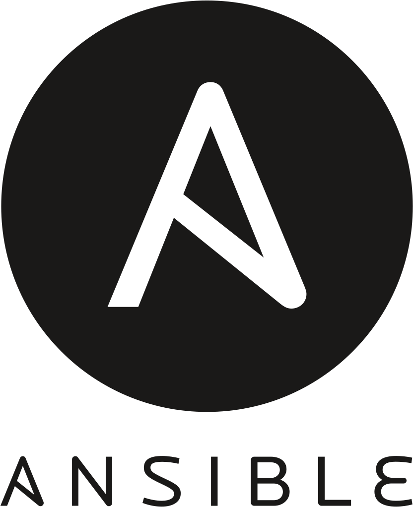

# Ansible EC2 Deployment

These ansible playbooks provision VMs on AWS focused on Windows.  This provisions the following:

* Base Infrastructure
  * A Microsoft Active Directory Server
  * A Windows Workstation for interacting with the environment
* Optional Additions
  * An Ansible Tower control node
  * A Gitlab server
  * Windows Host(s) for running playbooks against

The client pre-requisite to use this workshop is simply to have an RDP client which can connect to the Windows Workstation.  If RDP is not allowed through a corporate firewall, a HTML5 RDP client is also running on each Workstation.  As the HTML5 client is fairly slow, it is recommended that students use normal RDP if at all possible.  All other activities will take place from that Workstation.  The Workstation has Visual Studio Code, Chrome, Putty, and Git for Windows.  

## Usage

### Basic Requirements
Requirements for running the provisioner will vary based upon your environment and where you are provisioning to.  The basic requirements are the following

* Ansible >= 2.6
* Various Python Modules
  * pywinrm
  * boto >= 1.7 and boto3 (for AWS Provisioning)
  * ansible[azure] (for Azure Provisioning)
  * requests
  * requests-credssp
  * sshpass (use brew to install if OSX)
* Ansible Tower License

### AWS

You will need to setup your AWS configuration and Credentials.  Note that a standard AWS account is limited to 20 ec2 instances, so update your quota in advance.  Also note that each student gets 3 machines.  Make certain your VPC is large enough.  

You can set it up like this.

~/.aws/config
```
[default]
region = us-east-1
output = table
```

~/.aws/credentials
```
[default]
aws_access_key_id = <your ec2 access key>
aws_secret_access_key = <your ec2 secret key>
```

### General Config

Beyond that, the main thing that needs to be edited is the *vars/main.yml* file which contains the configuration details specific to your environment.  You should instead copy this file to *vars/custom.yml* and it will use that in place of the main.yml file.  It will check for the custom.yml file first, and use main.yml if its not found.  This ensure your settings are not overridden if you update git, and are not committed to git (this file is ignored).

For each workshop it is recommended that you utlilize the custom.yml to maintain the majority of the nonchanging settings, and then you can create a separate vars file (to be included in via extravars) with just the variables you need for the individual workshop.

```
## Example extra vars file
instance_loc: aws
name_prefix: "skylight"
user_count: 1
towerversion: 3.2.7
```


The main configurations to change are as follows:

DNS is available only in this environment.  The default is safe.  Set a domain admin password (that meets AD requirements).


```
# Needed for AD and windows client provision
domain_admin_password: "MyP@ssw0rd21"
```

Next we need to create user details.  First is the password set for all users.  This too needs to meet AD restrictions.

```
# Number of users and prefix for user name
users_password: "AnsibleWorkshop21#"
# Number of user labs to deploy
user_count: 2
```

That's it.  Easy, right ?!?   Now run it (it just executes on localhost):

```
ansible-playbook provision.yml
```
or if you are using separate var files for each workshop
```
ansible-playbook provision.yml -e @vars/myworkshop.yml
```


It takes roughly 1 hour to provision an environment for a single student.  For multi student accounts, it is recommended you set the number of forks to the number of students.  The main reason is so the Tower installations to run all in parallel.

All inventories will be placed in a folder named "workshops" in your local directory executing the playbook.  There are student#-instances.txt for each student there.  Also, there is an instructor-inventory.txt.  The student inventory is also placed on their tower host as /etc/ansible/hosts

## Connecting to the environment

The workshop has people connect through RDP to the workstation for their lab and then interact with other systems from there.  However, all systems are accessible publicly at the moment, so there is nothing stopping you from connecting directly.  

A "documents" server is created for the lab environment.  Once you run the provisioner, it will display information on how to reach this server.  The server itself hosts 3 items.
The lab guide is available at
```
http://<IPADDRESS>/
```
The decks are located at
```
http://<IPADDRESS>/decks/
```
When viewing the deck, you can bring up the speaker notes by pressing 's'

The User Signup page is located at
```
http://<IPADDRESS>/users/
```
The users will access this page to receive their user account information.  All of these are also available internally via a shortcut on their desktop.

A student list / progress tracker is available for admins at
```
http://<IPADDRESS>/users/list.php
```
You are required to enter your Domain Admin password to login to see the list.
